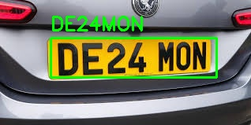

# 🚘 PlateVision

<p align="center">
  
  
  
  
  
</p>

<p align="center">
  <h1 align="center">🚘 PlateVision</h1>
  <p align="center">
    Deep Learning Based Automatic License Plate Recognition System
  </p>
</p>

---

## 📖 Overview

PlateVision is an end-to-end Automatic License Plate Recognition (ALPR) system built using modern Deep Learning and Computer Vision techniques.

The project combines:

* YOLOv8 for License Plate Detection
* EasyOCR for Character Recognition
* OpenCV for Image Processing

The system automatically detects vehicle license plates and extracts the corresponding plate number from images.

This project was developed as a practical Deep Learning and Computer Vision learning project.

---

## ✨ Features

* 🚗 License Plate Detection
* 🔍 Optical Character Recognition (OCR)
* 🧠 Custom YOLOv8 Training
* ⚡ CPU-Friendly Inference
* 📸 Image-Based Recognition
* 🏷️ Bounding Box Visualization
* 🎯 Confidence-Based Predictions
* 📦 Lightweight Architecture
* 🚀 Easy Deployment

---

## 🧠 Pipeline

```text
Input Image
      │
      ▼
YOLOv8 Detection
      │
      ▼
License Plate Localization
      │
      ▼
Plate Cropping
      │
      ▼
Grayscale Preprocessing
      │
      ▼
EasyOCR Recognition
      │
      ▼
Detected Plate Number
```

---

## 📸 Model Result

Replace the image below with your own result image.

<p align="center">
  
</p>

<p align="center">
  <i>License Plate Detection and Recognition Result</i>
</p>

---

## 📂 Dataset

The dataset used for training is publicly available on Kaggle.

### Download Dataset

📥 Dataset Link:

https://www.kaggle.com/datasets/ellislunnon/car-licence-plate-detection-yolo

The dataset contains vehicle images and license plate annotations used for training the YOLOv8 detector.

### Dataset Structure

After downloading and extracting the dataset:

```text
dataset/
├── train/
│   ├── images/
│   ├── annotations/
│   └── labels/
│
└── val/
    ├── images/
    ├── annotations/
    └── labels/
```

### Convert XML Annotations

The original dataset provides annotations in Pascal VOC XML format.

Convert annotations into YOLO format using:

```bash
python convert.py
```

After conversion:

```text
dataset/
├── train/
│   ├── images/
│   ├── annotations/
│   └── labels/
│
└── val/
    ├── images/
    ├── annotations/
    └── labels/
```

### Dataset Information

* Training Images
* Validation Images
* XML Annotations
* YOLO Labels
* Single Class: `licence`

---

## 🏗️ Project Structure

```text
PlateVision/
│
├── dataset/
│   ├── train/
│   └── val/
│
├── runs/
│
├── data.yaml
├── train.py
├── main.py
│
├── requirements.txt
├── yolov8n.pt
│
├── result.jpg
├── testcar_img.jpg
├── testcar_img2.jpg
│
└── README.md
```

---

## ⚙️ Installation

### Clone Repository

```bash
git clone https://github.com/yourusername/PlateVision.git

cd PlateVision
```

### Create Virtual Environment

```bash
python -m venv venv
```

### Activate Virtual Environment

Windows:

```bash
venv\Scripts\activate
```

Linux/macOS:

```bash
source venv/bin/activate
```

### Install Dependencies

```bash
pip install -r requirements.txt
```

---

## 📦 Requirements

```txt
ultralytics
opencv-python
easyocr
numpy
torch
torchvision
```

---

## 🎯 Training

Train the YOLOv8 license plate detector:

```bash
python train.py
```

Training Configuration:

* Model: YOLOv8 Nano
* Framework: Ultralytics
* Custom License Plate Dataset
* CPU Compatible

After training, the model weights will be saved automatically.

---

## 📥 Trained Model

After successful training:

```text
runs/license_plate/weights/best.pt
```

This file contains the best-performing trained model and can be used directly for inference.

---

## 🔍 Inference

Run license plate detection and OCR:

```bash
python main.py
```

Output:

```text
result.jpg
```

The resulting image contains:

* Detected License Plate
* Bounding Box
* Recognized Plate Number

---

## 📊 Example Output

```text
Plate: GJ03ER0563
```

---

## 🛠 Technologies Used

| Technology | Purpose               |
| ---------- | --------------------- |
| YOLOv8     | Object Detection      |
| EasyOCR    | Character Recognition |
| OpenCV     | Image Processing      |
| NumPy      | Numerical Computing   |
| Python     | Development           |
| PyTorch    | Deep Learning Backend |

---

## 🚀 Future Improvements

* 🎥 Video Processing
* 📹 Real-Time Webcam Detection
* 🌍 Multi-Country License Plates
* 🇮🇷 Iranian License Plate Recognition
* 🗄️ Database Integration
* 🌐 Flask/FastAPI Deployment
* 🐳 Docker Support
* 📱 Mobile Integration

---

## 🎓 Learning Objectives

This project demonstrates:

* Deep Learning Fundamentals
* Object Detection with YOLOv8
* OCR Integration
* Dataset Preparation
* XML to YOLO Conversion
* Model Training and Evaluation
* End-to-End Computer Vision Pipelines

---

## 📈 Performance

The system successfully detects vehicle license plates and performs OCR-based text extraction.

Performance may vary depending on:

* Image Resolution
* Plate Visibility
* Lighting Conditions
* OCR Confidence Score

---

## 🤝 Contributing

Contributions, suggestions, and improvements are welcome.

Feel free to fork the repository and submit a pull request.

---

## ⭐ Support

If you found this project useful, consider giving it a star ⭐ on GitHub.

---

## 👨‍💻 Author

Developed as a Deep Learning and Computer Vision project using YOLOv8, EasyOCR, OpenCV, and PyTorch.

---

<p align="center">
  Made with ❤️ using Python, YOLOv8 and Deep Learning
</p>
